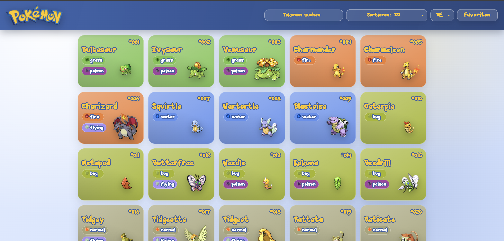
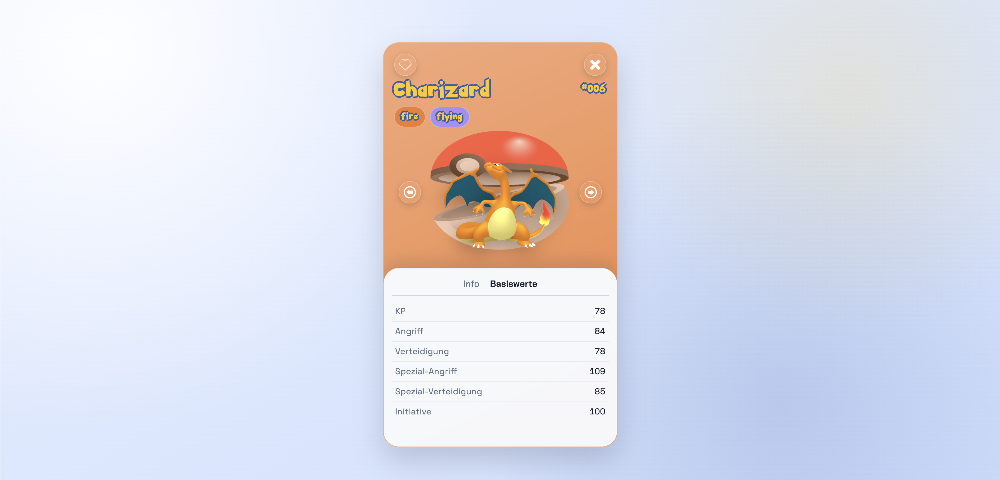

# Pokedex (Vanilla JavaScript)

Die Anwendung laedt Pokemon-Daten aus der [PokeAPI](https://pokeapi.co/) und bietet Suche, Sortierung, Favoriten und eine Detailansicht.

## Live Demo

- Demo: `LINK_EINFUEGEN`
- Repository: `https://github.com/<dein-user>/<dein-repo>`

## Screenshots

> Ersetze die Platzhalter durch echte Bilder aus deinem Projekt.




## Key Features

- Grid-Ansicht mit den ersten 151 Pokemon
- Nachladen in Bloecken oder kompletter Schnell-Load
- Suche nach Namen in Echtzeit
- Sortierung nach ID oder Name
- Favoritenmodus inkl. Toggle im Header
- Detailansicht mit Navigation (Buttons + Keyboard: `Esc`, `ArrowLeft`, `ArrowRight`)
- i18n-Sprachumschalter (`DE` / `EN`) fuer UI-Texte
- Responsives Layout fuer Desktop, Tablet und Mobile

## Was technisch geloest wurde

- API-Integration mit parallelen Requests pro Ladeblock via `Promise.all`
- Modulare Trennung nach Verantwortlichkeiten (`search`, `sort`, `favorites`, `detail`, `loader`, `i18n`)
- Robustes UI-State-Handling bei Favoriten, Suche und Detailansicht
- Verbesserte Accessibility-Bausteine (Semantik, Labels, Tastatur-Navigation)

## Tech Stack

- HTML5
- CSS3 (modular in `style/*.css`)
- Vanilla JavaScript (modular in `js/*.js`)
- Externe API: PokeAPI

## Lokales Starten

Die App sollte ueber einen lokalen Webserver laufen.

### Option 1: VS Code Live Server

1. Projekt in VS Code oeffnen
2. Extension "Live Server" installieren
3. `index.html` mit "Open with Live Server" starten

### Option 2: Python HTTP Server

```bash
python3 -m http.server 5500
```

Dann im Browser oeffnen:

```text
http://localhost:5500
```

## Projektstruktur

```text
.
|- index.html
|- README.md
|- js/
|  |- i18n.js
|  |- script.js
|  |- template.js
|  |- pokemonCart.js
|  |- search.js
|  |- sortBy.js
|  |- favorites.js
|  |- switchtypes.js
|  |- loader.js
|  `- pokeSounds.js
|- style/
|  |- style.css
|  |- header.css
|  |- footer.css
|  |- pokedex.css
|  |- pokemonCart.css
|  |- button.css
|  |- colors.css
|  |- helper.css
|  `- loader.css
`- assets/
   |- img/
   `- audio/
```

## Bekannte Limitierungen

- Datensatz ist bewusst auf die ersten 151 Pokemon begrenzt
- Favoriten sind aktuell nur im laufenden Browser-Tab verfuegbar (kein `localStorage`)
- Keine automatisierten Tests eingerichtet
